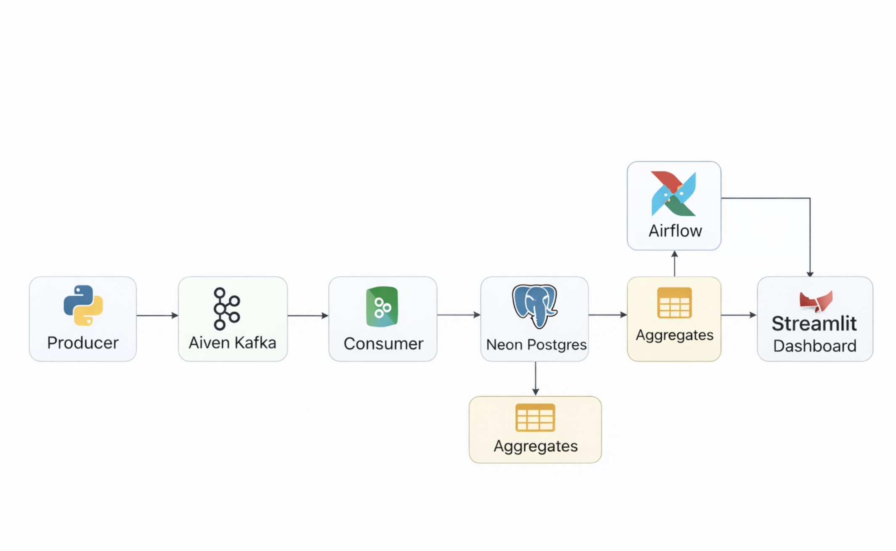
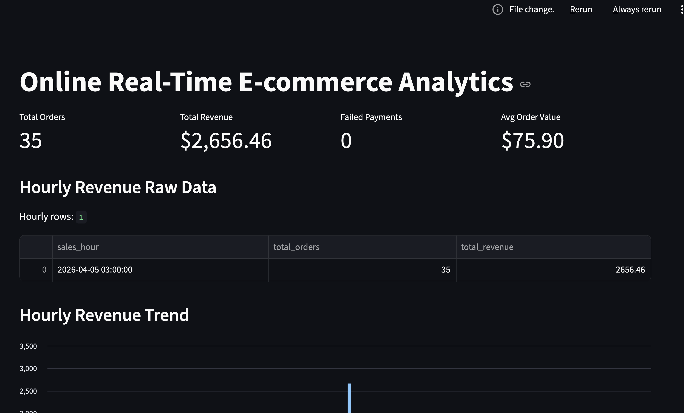
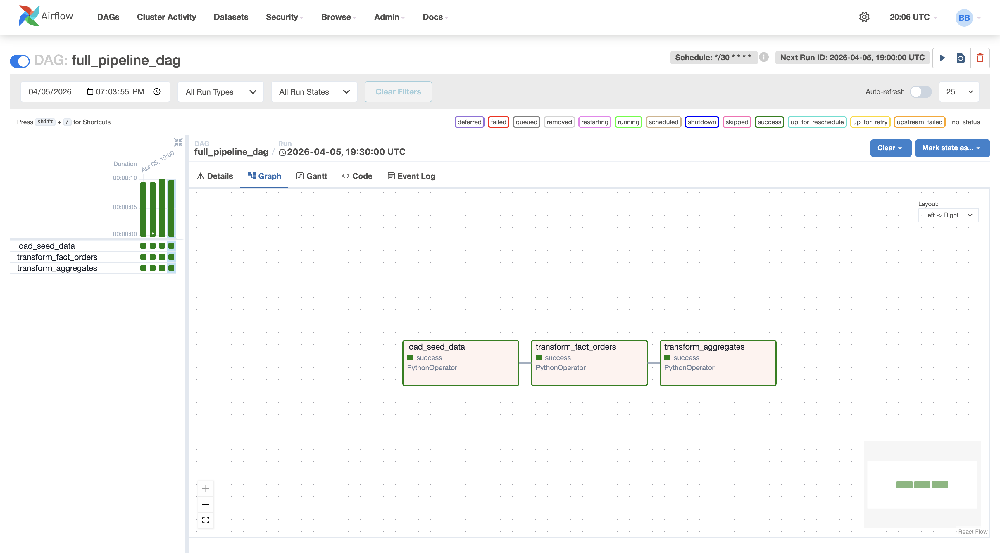
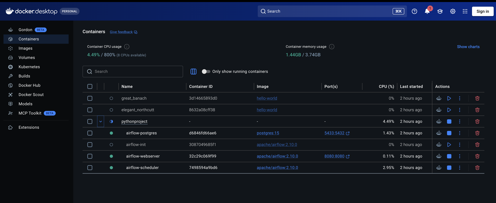
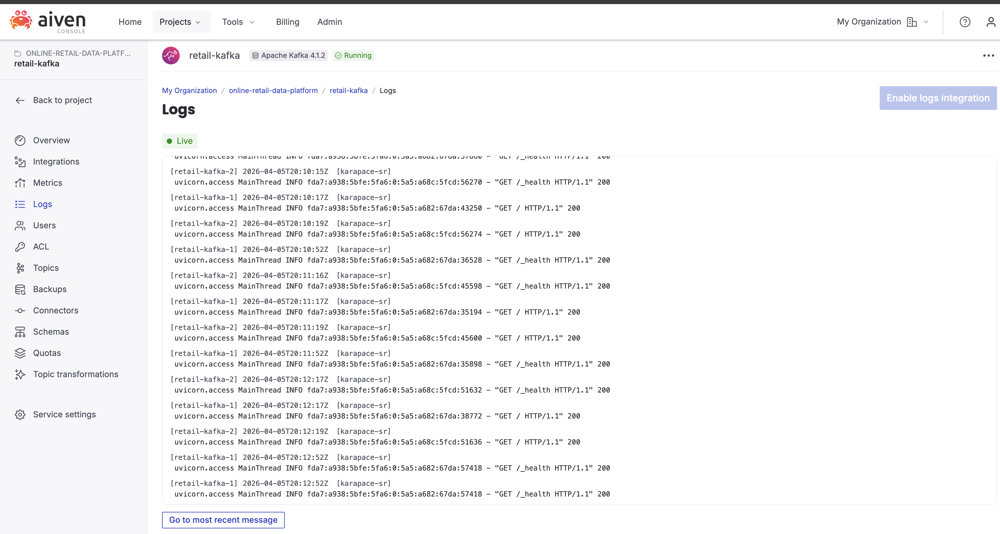

# Online Retail Data Platform

An end-to-end data pipeline for processing real-time and batch e-commerce data using Kafka, Airflow, PostgreSQL, and Streamlit.

## Overview

This project simulates an online retail system where transactional data is generated, streamed, processed, and visualized. It combines real-time ingestion with batch transformations to produce analytics-ready datasets.

## Architecture

## Tech Stack

- Streaming: Aiven Kafka
- Database: Neon PostgreSQL
- Orchestration: Apache Airflow (Docker)
- Backend: Python
- Visualization: Streamlit
- CI/CD: GitHub Actions

## Data Flow

1. Data Generation
   Synthetic events are generated using a Python producer.

2. Streaming
   Events are sent to a Kafka topic.

3. Ingestion
   A Kafka consumer reads events and stores them in the raw_ecommerce_events table.

4. Transformation
   ETL scripts transform raw data into structured tables:
   - fact_orders
   - agg_daily_sales
   - agg_hourly_orders
   - agg_top_products

5. Orchestration
   Airflow schedules and manages ETL workflows.

6. Visualization
   Streamlit dashboard displays key metrics and trends.

## Dashboard

The dashboard provides:

- Total orders and revenue
- Failed payments
- Revenue trends over time
- Top-performing products
- Recent transactions

## Setup Instructions

### 1. Clone repository
git clone https://github.com/bhuwanbkt/online-retail-data-platform.git
cd online-retail-data-platform

### 2. Install dependencies
pip install -r requirements.txt

### 3. Run Kafka pipeline
python producer/producer.py
python consumer/consumer.py

### 4. Run ETL scripts
python etl/load_seed_data.py
python etl/transform_fact_orders.py
python etl/transform_aggregates.py

### 5. Run Airflow (Docker)
docker compose -f docker-compose-airflow.yml up -d

### 6. Run dashboard
streamlit run dashboard/app.py

## Screenshots

### Dashboard

### Airflow DAG

### Docker

### Kafka

## CI/CD

GitHub Actions is used to run linting checks, execute tests, and validate project structure.

## Project Structure

producer/        Kafka producer
consumer/        Kafka consumer
etl/             ETL scripts
dags/            Airflow DAGs
dashboard/       Streamlit app
data/            Seed data
assets/          Images and diagrams